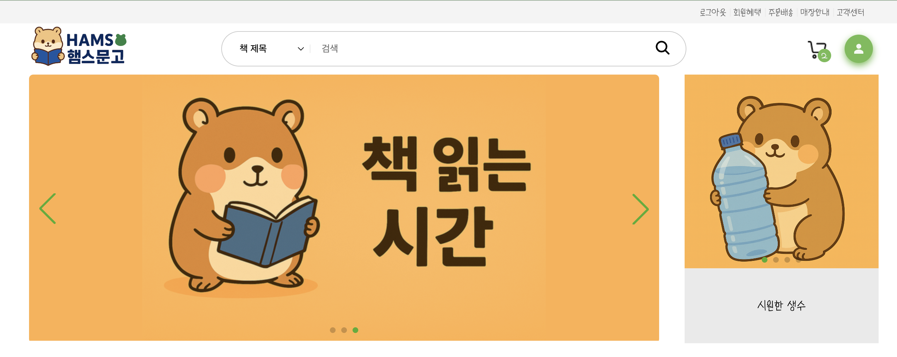

# 🐹 교보문고 클론코딩 - 햄스문고 🐹

## 📋 개요

- 프로젝트 명 : 햄스문고
- 프로젝트 기간 : 2025.10 ~ 2025.12
- 프로젝트 멤버 : 🐭김민주, 🐯이명석, 🐍조성은

<h2>📚 사용한 기술</h2>

 
   
   
   
   
  
    
   
  
   
  
   
   
  
  
   

## 📺 실행 화면

## 🤖 실행 방법

- git clone https://github.com/lms3140/APES_library.git
- cd frontend
- npm run dev
